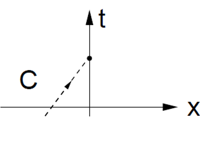
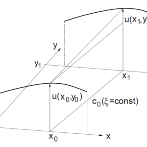
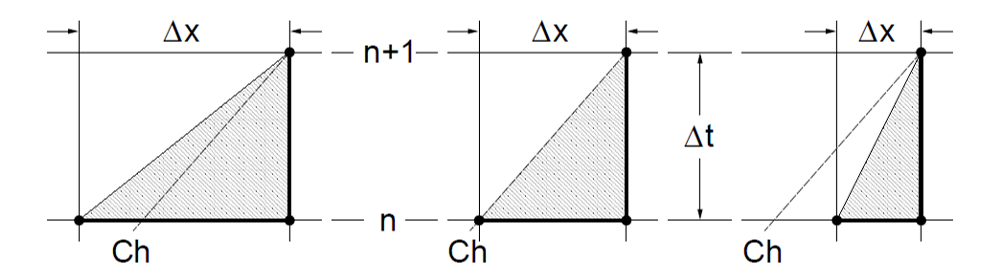
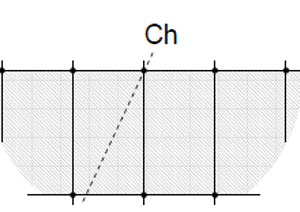

This article is an explanation of the Courant–Friedrichs–Lewy (or CFL) criteria when setting up numerical simulations. I’ve not used the formula itself – this article dives into a more intuitive understanding that you could use to remember the association of the CFL number with different discretization stencils. The CFL criteria comes into play in any CFD simulation while setting up the numerics of the problem, more specifically while deciding the best possible size of the time step that keeps the simulation stable. Let’s dive in:

Characteristic lines
A 1-D scalar transport equation can be written as:

$$a_t +  \lambda a_x = 0$$

The scalar transport equation represents a transport of a quantity a along space and time. Using this equation, if you plot on the space ( x ) vs time ( t ) axes, you can plot a line that has the slope \lambda . This line is the property of a differential equation – known as the characteristic line of the equation. In the 1-D scalar transport equation, this represents the direction in which a quantity will propagate both in space and time.

We illustrate the physical significance of these lines while taking the solution at an initial time step to be a wave, as in the figure below. The standard advection equation will try to move this wave forward in space and time – at a speed decided by the slope of the characteristic curve.

Numerics follow physics – the aim of someone trying to numerically solve this equation via a discretized stencil must make sure that the stencil of the discretization scheme in time and space is equipped to contain this characteristic line.

Let’s write down the stencil in space and time when using an explicit scheme, forward in time and backward in space.

$$a_t +  \lambda a_x = 0$$
$$\frac{a_i^{n+1} - a_i^{n} }{\Delta t} + \lambda \frac{a_i^{n} - a_{i-1}^{n} }{\Delta x} = 0$$

> The leftmost and middle stencils for forward differencing satisfy the CFL criteria, the rightmost stencil does not. Can you guess why?

The stencil uses values from the previous time step n at locations i and i-1 to calculate a value at time step n and location i . If we squeeze this mesh-time stencil, either by reducing del-x or increasing del-t , we run a risk of making the slope far too high to capture the characteristic line. This is the barebones explanation of the the Courant–Friedrichs–Lewy (or the CFL) condition.

## Implicit Schemes
For some comparison, let’s look at this stencil for the same equation:

$$\frac{a_i^{n+1} - a_i^{n} }{\Delta t} + \lambda \frac{a_{i+1}^{n+1} - a_{i-1}^{n+1} }{2\Delta x} = 0$$

This is an example of forward differencing in time and central differencing in space. The locations i+1 and i-1 at the new time step n+1 and the location i at the old time step are used. A cursory glance at the equation should reveal this too – and interested readers would be quick to point out that this is an implicit scheme.

Implicit schemes always cover the characteristic line by their very design – there is no CFL requirement (in theory).

References:

- [1] Hänel, Dieter and Meinke, Matthias: Computational Fluid Dynamics, RWTH Aachen, 2010

- [2] http://www.bio-physics.at/wiki/index.php?title=Transport_Equation