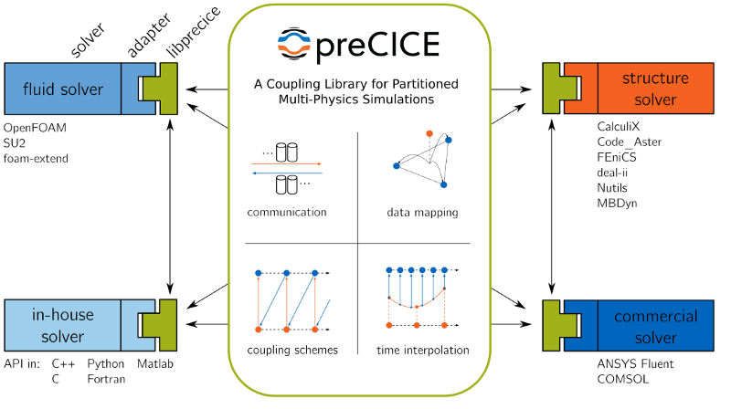
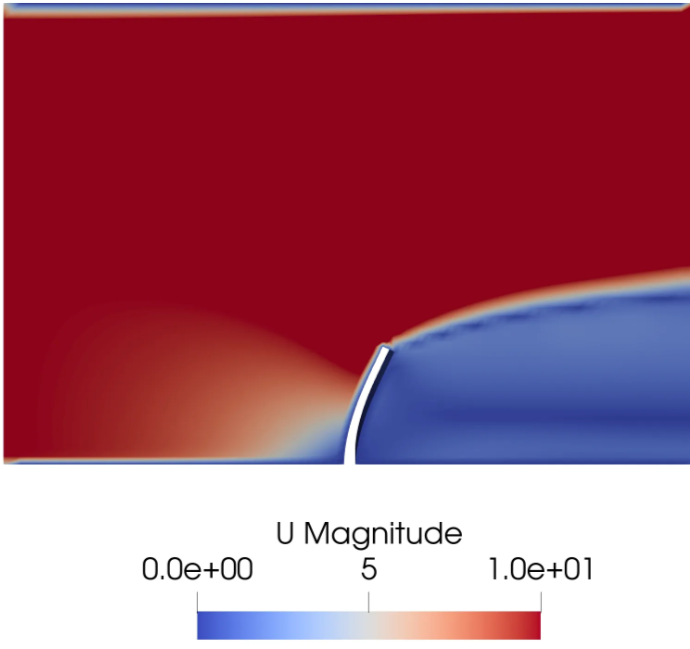
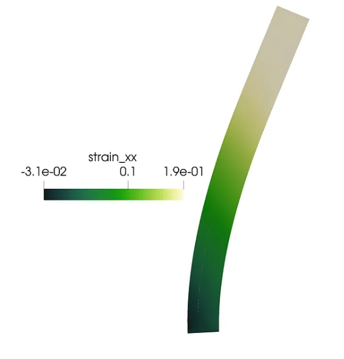
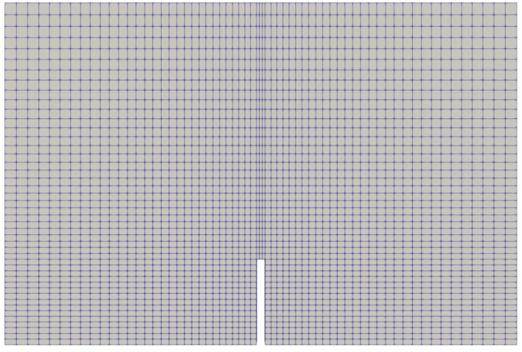
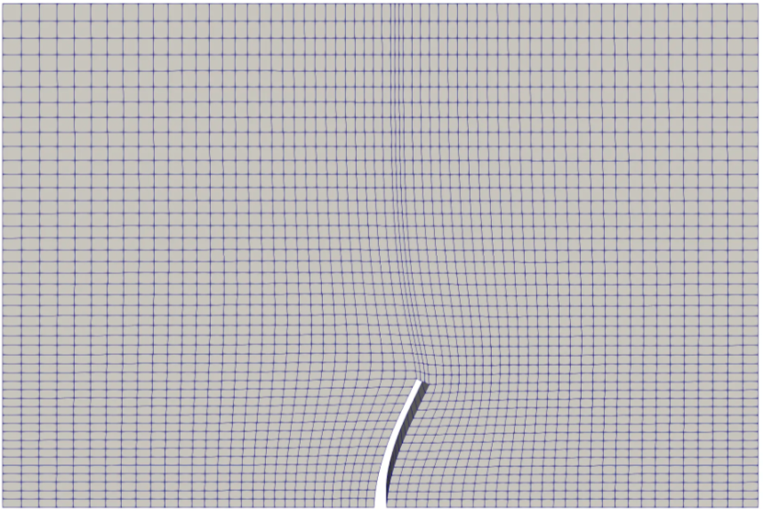

I spent a summer with a [research group](https://home.iitm.ac.in/sunetra/page4.html) specializing in a variety of topics in non-linear dynamics, one of them being the Fluid Structure Interaction (FSI) of flapping wings. It was 2015 — I did not work with OpenFOAM then, but I’m sure the more recent FSI solvers with [foam-extend](https://openfoamwiki.net/index.php/Extend-bazaar/Toolkits/Fluid-structure_interaction#fsiFoam_tutorial_cases) were only in their infancy, in terms of popularity.

foam-extend is getting a bit older for wear in 2020. Other development branches, including the ESI-OpenCFD (v1912 etc) that we’ve made use of on our WSL Ubuntu in previous articles may not be fully compatible with the other FSI utilities out there, including [FOAM-FSI](https://github.com/davidsblom/FOAM-FSI) (Feel free to correct me on this though).

I’m going to keep it short and get to the workflow. I want users to be able to set up a common FSI tutorial case — a perpendicular flap in a 2-D channel. There are a multitude of options — especially with the choice of a FE solver, I hope this helps you avoid a very tedious path to just setting up an environment. I had to personally go through a ton of debugging to set this up correctly — this should help everyone save some time.

How are forces transmitted back and forth between fluid and solid solvers? Here’s where [preCICE](https://www.precice.org/) comes in. PreCICE can couple different types of solvers together in a multi-physics environment. For example, an adapter communicates data from the fluid solver, which is then mapped via PreCICE and lands at the adapter of the solid solver, and then the other way around. There are adapters for a range of different solvers, which to me, gives PreCICE its appeal.



You need five things:

1. preCICE

1. A fluid solver — OpenFOAM (I use v19.12)

1. An OpenFOAM-preCICE adapter

1. A solid solver — deal.II

1. A deal.II-preCICE adapter

There are some dependencies I recommend you have before you start. These are the ones I needed for **Ubuntu-18.04**. Copy and paste the following in your terminal.

```bash
sudo apt update && \
sudo apt install build-essential cmake libeigen3-dev libxml2-dev libboost-all-dev python3-dev python3-numpy
```

As a note to organize your files better, create a directory titled FSI in your home folder that will house all the source code in the coming section. I’m going to assume you have a working OpenFOAM installation on your system. If not, check this out.

## Get preCICE

I prefer having the source and building with CMake. Follow the instructions in this [wiki](https://github.com/precice/precice/wiki/Building:-Using-CMake). For people still drawing a blank, cmake generates your MakeFile on which you run the command make for the actual compilation. `make install` sends the installed files to their intended locations on the system.

## Get the OpenFOAM adapter for preCICE

This is explained [here](https://github.com/precice/openfoam-adapter/wiki/Building). You will use the `Allwmake` script to create the adapter -which is actually just a shared library `preciceAdapterFunctionObject` , which needs to be referenced in `controlDict`. Don’t worry about this, the repository is equipped with working tutorials where you don’t need to change a thing!

## Get deal.II

This is the solid solver we’ll use. Just like preCICE, the installation is again done from source — you’ll have to [download the source code](https://www.dealii.org/9.2.0/readme.html) and compile it. This takes a while — allot a few hours for a compilation when done with a single processor.

> Note: I found it difficult to install deal.II with the OpenFOAM environment sourced because of clashing dependencies. Be sure to comment out sourcing the OpenFOAM `.bashrc` file in your system .`bashrc`.

## Get the deal.II adapter for preCICE

Follow the instructions on this [page](https://github.com/precice/dealii-adapter/wiki/Building).

Now — download the [tutorials repository](https://github.com/precice/tutorials/tree/master/FSI) in your **$FOAM_RUN** folder. These are the FSI cases we can test our environment with.

The tutorial we will test is the `FSI/flap_perp_2D/OpenFOAM-deal.II` in the tutorials folder.

Navigate to the deal.II adapter (D) source folder. The adapter has individual solvers which you can build with cmake and make . Do this in the `linear_elasticity/` subfolder. Copy the executable you get to the `FSI/flap_perp_2D/OpenFOAM-deal.II/Solid folder`. This is your solid solver executable.

**Open two terminals** — source one with OpenFOAM, leave the other one unsourced. On the unsourced terminal, after navigating to `FSI/flap_perp_2D/OpenFOAM-deal.II/`, run `./Solid/linear_elasticity Solid/linear_elasticity.prm`. This starts the solid solver — preCICE will now wait for you to execute OpenFOAM on the other terminal

Go to the terminal sourced with OpenFOAM. Run the runFluid script to launch the OpenFOAM run script. **This will start the solver on both terminals.**

It is important that you proof `controlDict` to make sure your fluid and solid results are being printed at the same time intervals. You will now have VTK folders in both `Solid/` and `Fluid/` folders which can be read into Paraview.






This is a `dynamicMesh` being employed. You can observe the changes in the structure with each time step. For instance, the meshes at the first and last time step look like this:





This could be a good point for more complicated simulations. I’m no expert on deal.II, but there are other models, including non-linear elasticity that can be employed. 3-D cases, including the possibility of preparing cases for flapping airfoils — if you have other ideas on simple use cases in FSI, write to me!
