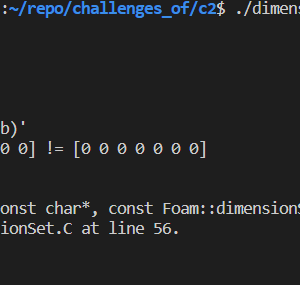

Most of the data manipulation in OpenFOAM happens on fields – more specifically, tensor fields. These are matrices of data – velocity, pressure, etc.

There are three element types manipulated in OpenFOAM – and these are the standard mathematical quantities that we normally work with – scalars, vectors, and tensors.

| Rank | Element Type |
|------|--------------|
| 0    | Scalar       |
| 1    | Vector       |
| 2    | Tensor       |

1. `List`: Basic array of objects with allocation and resizing
2. `PtrList`: Basic array of pointers
3. `Field`: A List with algebra operations
4. `Dimensioned Field`: A `Field` with I/O, dimension set, name, mesh reference
5. `Geometric Field`: `Dimensioned Field` consisting of a internal field, boundary
conditions etc

A `Field` is just a container (list) with algebra operations defined for it. A temperature field dictionary is shown below as an example:

```cpp
FoamFile //data file header
{
    version     2.0;
    format      ascii;
    class       volScalarField;
    object      T;
}

dimensions      [0 0 0 1 0 0 0]; //keyword dimension of field (Input to dimensionedSet)

internalField   uniform 0; //keyword for value of internal field 

boundaryField //keyword for value of boundary field
{
    inlet
    {
        type            fixedValue;
        value           uniform 1;
    }
}
```
What you see in a dictionary like this is just a set of key-value pairs: the first segment is the data file header – which reads values from the dictionary entry `FoamFile`.

The second keyword – dimensions, is what I’m now interested in – this provides fields with a dimension. This is what makes a field – a `dimensionedField`, i.e. a field class which accepts a `dimensionedSet` argument into its constructor.

```cpp
dimensionedField
(
const IOobject& io,
const Mesh& mesh,
const dimensionSet& dims,
const Field <Type >& field
);

```

The I/O format for a `dimensionSet` is 7 scalars in a square bracket. In our example it was temperature:

```cpp

dimensions      [0 0 0 1 0 0 0];
```

This attaching of dimensions serves as a safeguard against meaningless operations. We’ll do a quick test in code to see how this works in practice. Here, we use our code template from the previous article . Add a dimensionedScalar (templated on dimensionedField)
```cpp

dimensionedScalar inputPressure =
dimensionedScalar
(
"pressure", /// A name field
dimensionSet( 1, -1, -2, 0, 0, 0, 0 ),
1.0 /// Value to initialize
);
```
> Note – you could have just as easily read this from a dictionary too if you had a dictionary entry like this
 `inputPressure             pressure  [1 -1 -2 0 0 0 0]  1.0;`
 This entry just contains the name, dimensionSet, and the value to initialize with.

Now, create another dimensionedScalar as follows:

```cpp

dimensionedScalar Number =
dimensionedScalar
(
"dimless", /// A name field
dimless,
1.0 /// Value to initialize
);
```
Here – we create a scalar “Number” with no dimensions – a dimensionless quantity. Now try doing something as simple as:
```cpp
inputPressure = Number;
```

You see the dimensions do not match – which breaks the run and asks the user to check and correct dimensions of the quantities. 


