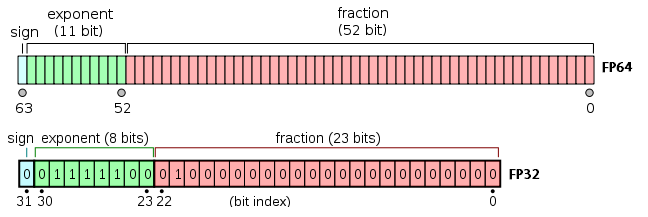

Floats are complicated. Never trust them. We know the infamous $0.1 + 0.2 \neq 0.3$ (look up [0.30000000000000004.com](https://0.30000000000000004.com))

This is because:
- The format for storing floating-point numbers which almost all computers use has limited precision,
- and that format uses binary, not decimal, and when converted to binary, 1/10 is an infinite recurring fraction


When summing many floating-point numbers, small values can get "lost" due to rounding. IEEE‑754 doubles store a sign, an 11‑bit exponent, and a 53‑bit significand (52 bits stored + 1 hidden leading bit). That means any real number you hold must be rounded to the nearest value whose binary fraction has ≤ 53 bits. For example:

```cpp
double sum = 1e8;
sum += 1e-4; // stays 1e8
```


The problem is non-associativity. This can happen in situations like sampling where small instantaneous inputs can be added to a running total.

Consequently, $(a+b)+c$ can differ from $a + (b + c)$. Summing small numbers after large ones repeatedly causes their bits to be shifted out at every step, so total error can grow.


## Kahan Summation
Kahan fixes this by tracking the rounding error and adding it back:

```cpp
double kahanSum(const std::vector<double>& v) {
    double sum = 0.0, c = 0.0;
    for (double x : v) {
        double y = x - c;
        double t = sum + y;
        c = (t - sum) - y;
        sum = t;
    }
    return sum;
}
```


Kahan summation keeps a tiny compensation $𝑐$ that tracks the low‑order part that got rounded away at each step. On the next addition it adds $c$ back first, so those lost bits get a chance to land in higher, retainable positions of the significand before the big add happens, dramatically reducing loss.