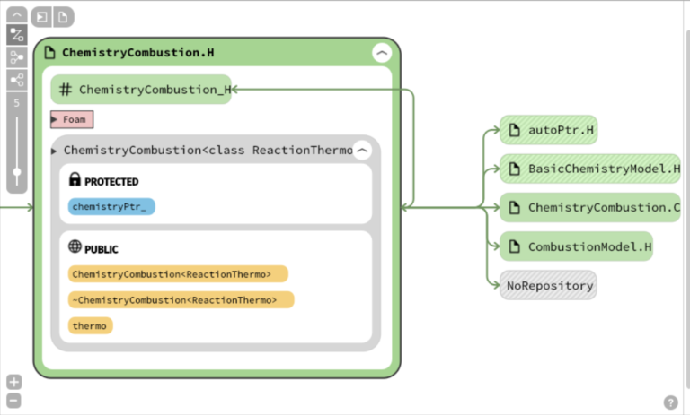

I came across Sourcetrail a few days ago – and I’m sold. I’ve often been asked the best way to start navigating a seemingly daunting codebase . Sourcetrail will make your learning experience quicker. A lot quicker.

In one of my first ever articles, I covered how one might step through OpenFOAM functions with a gdb debugger – using a VSCode interface. This is good – but not good enough. This works when knowing how the narrow code path that executes in that instance is all that is required, which is often not the case. The Intellisense feature has a “Find all references” feature too – but it misses the dependency graph view that we expect from UML diagrams.


Sourcetrail indexes the source code to find all definitions and references within your source files.

A sample file `ChemistryCombustion.C` has a class `ChemistryCombustion` declared in `ChemistryCombustion.H` . Looking closer, this class derives from `CombustionModel`. The class has its usual constructor, destructor and member functions defined in this file.

```cpp

#include "ChemistryCombustion.H"

// * * * * * * * * * * * * * * * * Constructors  * * * * * * * * * * * * * * //

template<class ReactionThermo>
Foam::ChemistryCombustion<ReactionThermo>::ChemistryCombustion
(
    const word& modelType,
    const ReactionThermo& thermo,
    const compressibleMomentumTransportModel& turb,
    const word& combustionProperties
)
:
    CombustionModel<ReactionThermo>
    (
        modelType,
        thermo,
        turb,
        combustionProperties
    ),
    chemistryPtr_(BasicChemistryModel<ReactionThermo>::New(thermo))
{}


// * * * * * * * * * * * * * * * * Destructor  * * * * * * * * * * * * * * * //

template<class ReactionThermo>
Foam::ChemistryCombustion<ReactionThermo>::
~ChemistryCombustion()
{}


// * * * * * * * * * * * * * * Member Functions  * * * * * * * * * * * * * * //

template<class ReactionThermo>
const ReactionThermo&
Foam::ChemistryCombustion<ReactionThermo>::thermo() const
{
    return chemistryPtr_->thermo();
}


// ***

```




`ChemistryCombustion.H` depends on certain files which are listed as includes in the image above. The access specifiers of the different class members are highlighted in the diagram too. Since `ChemistryCombustion.C` includes and is included by `ChemistryCombustion.H`, this shown by the bidirectional arrow graph.

The advantages of looking at your source code through this lens are more than great, especially while understanding and refactoring the code. What’s better – this is completely interactive – navigating to each symbol redirects you to its corresponding location in the code.

What’s even better? You can hook this up with an IDE/editor of your choice (VSCode has entered the chat)


## Setting up Sourcetrail

I’ll show you how you can set this up as quickly as possible. To set up Sourcetrail, you need to tell it what source and header files to include – this must be a terror to do manually. Luckily, a compilation database – something Clang can use to conduct a compilation, contains all the include paths that an “Intellisense” like tool must parse through. This compilation database is called `compile_commands.json`.

There are multiple ways to generate this for big projects:

1. CMake: When using a CMake to generate a Makefile, you can generate this database with the flag..
```bash
cmake -DCMAKE_EXPORT_COMPILE_COMMANDS=1
```
2. Visual Studio: Look for the “Sourcetrail” extension to generate this file from a VS Solution

3. Other build tools – Bear

This falls right in our basket. For non-cmake, non VS projects, Bear generates the JSON file during the build process. Bear tries to run the build command and intercepts the instructions during the build process. The build command in the OpenFOAM environment is wmake – we know what to do!

On your Ubuntu distro, run:
```bash
sudo apt-get install -y bear
```
Then, simply navigate to the folder where the source files and their Make/ folder is present. Run:
```bash
bear wmake
```
You should be able to index the whole source code too. I haven’t tried this yet – I’m afraid this may take quite some time:

```bash
bear ./Allwmake
```
This generates a compile_commands.json file as discussed. Now, open a Sourcetrail instance and create a new project. Select “Create a Source Group from Compilation Database” to continue – this will prompt you to add a compile_commands.json file – do so, and allow some time for the files to index. Voila, you’re good to go!

VSCode has an extension called “Sourcetrail” that allows integration with the application. Once installed, this allows you to send the location in your IDE and represent it in Sourcetrail.


