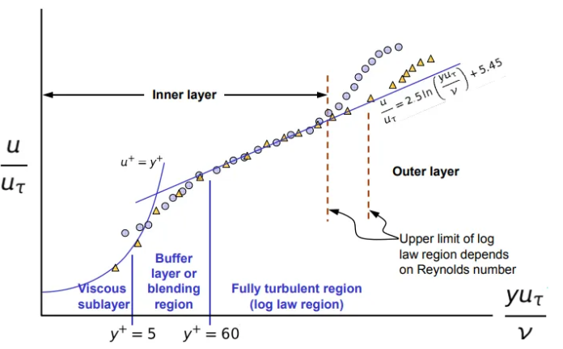

There’s no way around turbulence modelling. When George Box famously said “*All turbulence models are wrong, some are useful*”, I’m sure notice was taken as to how absolutely *useless* CFD results are for setups that lack appropriate turbulence models and mesh resolution near a wall. It is indeed a *Garbage-In-Garbage-Out* business.

I will assume readers have a basic overview of turbulence and associated theory. For beginners, you can catch up [here](https://www.simscale.com/blog/2017/12/turbulence-cfd-analysis/). I’ll just dive into an explanation of wall functions and what the code in OpenFOAM looks like.

If you don’t have wall functions — you need to fully resolve your boundary layer (called using a **Low Reynolds Number — LRN** approach). This means, your first cell must be small enough to fit comfortably inside the viscous sublayer. This means your y⁺ value should be around 1. This is done most often using layers — but this is expensive business, in terms of mesh resolution. If you use a wall function, you can skip the tedious business of modelling the boundary layer velocity until y⁺ = 30 (this value varies across models, but generally this is where the buffer layer ends and the log layer starts )— and replace it with a profile that is already known. That’s a wall function — it is a defined velocity profile until a certain y⁺. This is called a **High Reynolds Number (HRN)** approach.


The plot below is logarithmic in y⁺. The curve you see for the viscous sublayer actually represents a linear relation between u⁺ and y⁺, where u⁺ is the velocity non-dimensionalized with a friction velocity uₜ. For a quick catch up, other turbulence quantities are described [here](https://www.cfd-online.com/Wiki/RANS-based_turbulence_models). All quantities are non-dimensionalized as shown below:

$$
y^+ = \frac{y u_\tau}{\nu} 
$$
$$
k^+ = \frac{k}{u_\tau^2}
$$
$$
\omega^+ = \frac{\omega \nu}{u_\tau^2}
$$


OpenFOAM prescribes:

1. **Viscous sublayer**: $$u⁺ = y⁺$$

1. **Log layer**: where $$κ =0.41$$ and $$E =9.8$$

3. **Buffer layer**: Switch between viscous and log layer calculation depending on y⁺

Let’s look at this in the code. Move to the directory with the source code for wall functions:

```bash
cd $FOAM_SRC/TurbulenceModels/turbulenceModels/derivedFvPatchFields/wallFunctions
```


The [k-ω SST model](https://www.cfd-online.com/Wiki/SST_k-omega_model) has a blended approach to selecting the turbulence model, switching between k-ω and [k-ϵ](https://www.cfd-online.com/Wiki/K-epsilon_models) based on a blending function depending on the distance from the wall. Moreover, the **turbulence dissipation rate ω** can handle both LRN and HRN approaches depending on the y⁺ value. Let’s look at the equation for **turbulent kinetic energy, k**:

**

This equation is first non-dimensionalized (based on [[1]](http://citeseerx.ist.psu.edu/viewdoc/download?doi=10.1.1.584.2507&rep=rep1&type=pdf)), yielding

1. **Viscous sublayer**

$$ 
k^+ = C_k (y^+)^{3.23}
$$

2. **Log layer**

$$
k^+ = \frac{C_k}{\sigma_k^k} \log(y^+) + B_k
$$

The modelling of the buffer layer is done based on the y⁺ value. This needs the friction velocity, which is calculated as:

$$
u_\tau = (C_\mu)^{\frac{1}{4}} (k)^{\frac{1}{2}}
$$

This can be compared to the code. Open the kLowReWallFunctionFvPatchScalarField.H file. The most important function in any wall function file in OpenFOAM is the updateCoeffs() function.

```cpp
    const scalar Cmu25 = pow025(nutw.Cmu());
    const scalar yPlus = Cmu25*y[facei]*sqrt(k[celli])/nuw[facei];
```

The quantity yPlusLam marks where the switch happens. This value is about 11. If the value of y⁺<yPlusLam , this is in the viscous sublayer region, where the corresponding formula is applied. If y⁺>yPlusLam , the log-law region formula is used.


```cpp
// Set k wall values
forAll(kw, facei)
{
    const label celli = patch().faceCells()[facei];

    const scalar uTau = Cmu25 * sqrt(k[celli]);
    const scalar yPlus = uTau * y[facei] / nuw[facei];

    if (nutw.yPlusLam() < yPlus)
    {
        kw[facei] = Ck_ / nutw.kappa() * log(yPlus) + Bk_;
    }
    else
    {
        const scalar Cf =
            1.0 / sqr(yPlus + C_) + 2.0 * yPlus / pow3(C_ - 1.0 / sqr(C_);
        kw[facei] = 2400.0 / sqr(Ceps2_) * Cf;
    }

    kw[facei] *= sqr(uTau);
}


```


A similar equation is obtained for the near-wall region from the ω transport equation:

$$
-\beta_1 (\omega^+)^2 + \frac{d^2 \omega^+}{(dy^+)^2} = 0
$$

For ω, there are two solutions as well:

1. **Viscous sublayer**
$$
\omega^+ = \frac{6}{\beta_1 (y^2)}
$$


2. **Log layer**
$$
\omega^+ = \frac{k^{1/2}}{(C_\mu)^{1/4} \kappa y}
$$


The resultant omega is a magnitude quantity from both these omegas. For a lower y, the 1/y² quantity is dominant, and hence the treatment is that of a viscous sublayer. Compare this to the code in omegaWallFunctionsFvPatchScalarField.C.

```cpp
const label celli = patch().faceCells()[facei];

const scalar yPlus = Cmu25 * y[facei] * sqrt(k[celli]) / nuw[facei];

const scalar w = cornerWeights[facei];

const scalar omegaVis = 6 * nuw[facei] / (beta1_ * sqr(y[facei]));
const scalar omegaLog = sqrt(k[celli]) / (Cmu25 * nutw.kappa() * y[facei]);

bool includeG = true;
if (blended_)
{
    omega0[celli] += w * sqrt(sqr(omegaVis) + sqr(omegaLog));
}

```

Note that you see a w = cornerWeights[facei]; line there. The w is a weight that is multiplied to any resulting quantity. This can be seen in the function createAveragingWeights()

```cpp
forAll(bf, patchi)
{
    if (isA<omegaWallFunctionFvPatchScalarField>(bf[patchi]))
    {
        omegaPatches.append(patchi);

        const labelUList& faceCells = bf[patchi].patch().faceCells();
        forAll(faceCells, i)
        {
            const label celli = faceCells[i];
            weights[celli]++;
        }
    }
}


```

Why is this done? Because quantities like omega (ω) are calculated at the cell-centre. If more faces on a cell lie on a boundary patch (bf[patchi]), the cell-centre has to be a weighted average of the quantities on each face. For the turbulence kinetic energy k, this is not done as the cell face values are used.

There are other quantities like the turbulent viscosity μₜ (nut), which require wall functions to correctly calculate the wall shear stress. I could cover this in another article.



**Handy references:**

[1] Kalitzin, G., Medic, G., Iaccarino, G., & Durbin, P. (2005). Near-wall behavior of RANS turbulence models and implications for wall functions. *Journal of Computational Physics*, *204*(1), 265–291
